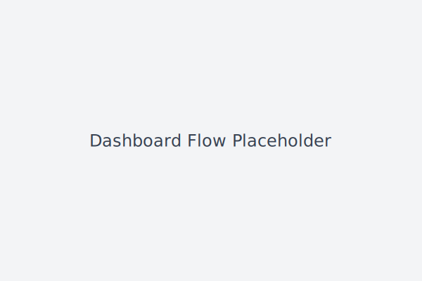
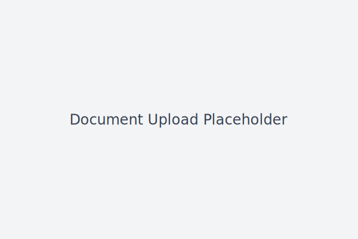

# Grant AI Platform Backend

This repository contains three microservices used to test a grant eligibility workflow.

- **server/** – Express API for authentication, file uploads and analysis forwarding
- **ai-analyzer/** – FastAPI service that extracts text using Tesseract OCR and simple NLP with confidence scores while enforcing API key authentication, a 5MB upload limit and ClamAV virus scanning
- **eligibility-engine/** – Python rules engine returning missing fields and suggested next steps
- **ai-agent/** – LLM-ready service with conversational endpoints and smart form filling

All Node.js dependencies are pinned to exact versions, and the server runs on the stable Express 4.18.2 release for consistent builds. Python microservice dependencies are likewise pinned in their respective `requirements.txt` files.

## Persistence

User cases, pipeline state, uploaded file metadata and AI agent conversations are now stored in MongoDB. Sessions are persisted in a TTL-indexed collection and file uploads stream to disk with their paths tracked in the database. See [`docs/mongo-security.md`](docs/mongo-security.md) for details on authentication, TLS and role setup.

The eligibility engine now ships with templates for common programs including a Business Tax Refund Grant, a Veteran Owned Business Grant, the Employee Retention Credit (ERC), a comprehensive Rural Development Grant covering USDA sub-programs, a Green Energy State Incentive aggregating state-level rebates, credits and grants for renewable installations, an Urban Small Business Grants (2025) package spanning nine city programs, and a California Small Business Grant (2025) bundling the Dream Fund, STEP export vouchers, San Francisco Women’s Entrepreneurship Fund, Route 66 Extraordinary Women Micro-Grant, CDFA grants, RUST assistance, CalChamber awards and the LA Region Small Business Relief Fund.
The Rural Development configuration now includes federal form templates for SF-424, 424A, RD 400-1, RD 400-4 and RD 400-8.

```
project-root/
  server/               Express REST API
  ai-agent/             FastAPI form filler and reasoning service
  ai-analyzer/          OCR/NLP stub service
  eligibility-engine/   Core rules engine
  frontend/             Next.js application
```

The document upload flow accepts **PDF**, **JPG/JPEG**, and **PNG** files up to 5MB each and scans them for viruses before analysis. All upload endpoints require valid authentication and will reject unauthorized requests. The ClamAV binary used for scanning can be customized with the `CLAMSCAN_PATH` environment variable.

### Veteran Owned Business Grant

This program awards a flat $10,000 to five veteran-owned small businesses each year.
To qualify, a business must:

- Have at least 51% ownership by a veteran or military spouse.
- Employ between 3 and 20 people.
- Earn no more than $5 million in annual revenue.
- Operate in one of the 50 U.S. states and be located in an economically vulnerable area.
- Avoid disqualified business types such as non-profits or restricted franchises.

## Grant Submission Pipeline

The backend exposes a unified flow that processes grant applications end‑to‑end:

1. **POST `/api/submit-case`** – Frontend sends raw user data and uploaded documents. The server forwards data to the AI Analyzer (`AI_ANALYZER_URL/analyze`) to extract and normalize fields.
2. **AI Analyzer → Eligibility Engine** – Normalized data is submitted to the Eligibility Engine (`ELIGIBILITY_ENGINE_URL/check`) for rule-based eligibility checks.
3. **Eligibility → AI Agent** – Eligibility results and normalized data are passed to the AI Agent (`AI_AGENT_URL/form-fill`) which generates filled PDFs and summaries.
4. **Digital signature & submission** – Hooks exist after form filling for optional signing and external submission.
5. **GET `/api/status/:caseId`** – Fetch case status, eligibility results and generated documents for the applicant dashboard.

All service calls exchange JSON payloads, are logged, and bubble up descriptive errors if a downstream service fails.

Environment variables configuring service locations:

```
AI_ANALYZER_URL=https://ai-analyzer:8000
ELIGIBILITY_ENGINE_URL=https://eligibility-engine:4001
AI_AGENT_URL=https://ai-agent:5001
```

## Authentication

Internal Python services (AI Agent, AI Analyzer, Eligibility Engine) require an `X-API-Key`
header that matches the target service's API key (e.g. `AI_AGENT_API_KEY`). During key
rotation the `*_NEXT_API_KEY` value is also accepted. Example:

```bash
curl -k -H "X-API-Key: your_key" https://localhost:5001/status
```

To rotate a key, deploy the new value via the `*_NEXT_API_KEY` variable on the target
service and its callers. Requests are accepted with either key. Once callers are
updated to use the new key, promote it to `*_API_KEY` and remove the old value.

Requests without a key return **401 Unauthorized**. The Express server protects routes under `/api` using JWT bearer tokens:

```bash
curl -k -H "Authorization: Bearer <token>" https://localhost:5000/api/users
```

A missing or invalid token results in **401 Unauthorized**.

The utility `/echo` endpoint is likewise protected and requires a valid JWT. Prometheus metrics at `/metrics` are secured with
HTTP Basic auth; set `METRICS_BASIC_AUTH=user:pass` and scrape with `curl -u user:pass https://localhost:5000/metrics`.

JWT payloads also contain a user's `role` (`user` or `admin`). The backend exposes a
`requireRole('admin')` middleware used by admin-only endpoints such as
`POST /api/form-template`.


### Case Management API

The frontend interacts with a simpler set of endpoints that manage a user's in‑progress case:

| Endpoint | Method | Description |
| --- | --- | --- |
| `/api/case/status` | GET | Current case status, required documents and any eligibility results |
| `/api/case/questionnaire` | GET/POST | Retrieve or store questionnaire answers |
| `/api/files/upload` | POST | Upload a single document (fields: `file` and `key`) |
| `/api/eligibility-report` | GET/POST | Fetch or trigger eligibility analysis |

All routes are protected and expect a `Bearer` JWT token. Service URLs for the AI Agent, Eligibility Engine and Form Filler are configured with the environment variables shown above.

### Questionnaire Payload

`POST /api/case/questionnaire` accepts JSON with the following fields. Numeric strings will be converted to numbers, boolean-like strings are parsed, and dates must be in `dd/MM/YYYY` format.

| Field | Type | Required? | Notes |
| --- | --- | --- | --- |
| businessName | string | yes | |
| phone | string | yes | |
| email | string (email) | yes | valid email format |
| address | string | no | |
| city | string | no | |
| state | string | no | |
| zipCode | string | no | |
| locationZone | string | no | e.g. `urban` |
| serviceAreaPopulation | number | no | population of the area served |
| organizationType | string | no | e.g. `municipality`, `nonprofit` |
| incomeLevel | string | no | `low`, `moderate`, or `high` |
| projectType | string | no | `community_facilities`, `rbdg`, `rcdg`, `redlg` |
| projectCost | number | no | total project budget |
| projectState | string | no | state where project occurs |
| duns | string | no | DUNS registration number |
| sam | boolean/string | no | SAM registration status |
| cageCode | string | no | CAGE code |
| businessType | string | yes | allowed: `Sole`, `Partnership`, `LLC`, `Corporation` |
| incorporationDate | string (date) | yes | format `dd/MM/YYYY` |
| businessEIN | string | no | |
| annualRevenue | number | no | |
| netProfit | number | no | |
| numberOfEmployees | number | no | |
| ownershipPercentage | number (0-100) | no | |
| previousGrants | boolean | no | |

## Running locally

1. Install Node dependencies and start the API server. Dependency versions, including Express 4.18.2, are pinned in `package.json` and `package-lock.json`.
   ```bash
   npm install
   node server/index.js
   ```
   Create a `.env` file in the repository root (copy from `.env.example`) and set
   credentials for a TLS-enabled MongoDB connection along with other service URLs:

   ```
   MONGO_URI=mongodb://mongo:27017/grants?authSource=admin&tls=true
   MONGO_USER=serverUser
   MONGO_PASS=strongPassword
   MONGO_CA_FILE=/path/to/ca.pem
   ```

2. Start the AI analyzer service
   ```bash
   cd ai-analyzer
   pip install -r requirements.txt
   python -m uvicorn main:app --port 8000
   ```
3. Start the AI agent service
   ```bash
   cd ai-agent
   pip install -r requirements.txt
   python -m uvicorn main:app --port 5001
   ```
   The AI agent requires its own `.env` file (see `ai-agent/.env.example`) with
   authenticated TLS settings for MongoDB (`MONGO_URI`, `MONGO_USER`,
   `MONGO_PASS`, and `MONGO_CA_FILE`) and, optionally, `OPENAI_API_KEY`.
4. Start the eligibility engine
   ```bash
   cd eligibility-engine
   pip install -r requirements.txt
   python -m uvicorn api:app --port 4001
   ```
5. (Optional) Run the eligibility engine tests
   ```bash
   cd eligibility-engine
   python -m pytest
   ```

The `ai-agent` service can parse free-form notes and uploaded documents, infer missing fields
and provide human readable summaries. Eligibility results now include a `next_steps` field
along with any missing information:

```bash
curl -k -X POST https://localhost:5001/check -H "Content-Type: application/json" \
    -d '{"notes": "We started around 2021 and are women-led in biotech"}'
```

To fill a grant application form, send JSON directly to `/form-fill`:

```bash
curl -k -X POST https://localhost:5001/form-fill \
    -H "Content-Type: application/json" \
    -d '{
        "form_name": "form_8974",
        "user_payload": {
            "employer_identification_number": "12-3456789",
            "name": "Acme Corp"
        }
    }'
```

## Frontend

The **frontend/** directory contains a Next.js application used for end-user registration, login and document uploads.

To start the frontend locally:

```bash
cd frontend
npm install # install dependencies (requires internet access)
npm run dev
```

Environment variables should be placed in a `.env.local` file. See `.env.local.example` for the API base URL.
The backend uses `AI_ANALYZER_URL`, `ELIGIBILITY_ENGINE_URL` and `AI_AGENT_URL` to locate the downstream services.

### Testing file uploads

1. Visit [https://localhost:3000](https://localhost:3000) and register or log in.
2. From the dashboard choose **OPEN CASE** and complete the questionnaire wizard.
3. On the **Documents** step upload sample files (PDF, JPG, JPEG or PNG). Use the **Replace** button to update a document.
4. When all documents are uploaded, click **Submit for Analysis** to see eligibility results.





## Docker Compose

The repository includes a `docker-compose.yml` that spins up all services in one command. This will launch MongoDB, the API server, auxiliary Python services, and the Next.js frontend.

```bash
docker-compose up --build
```

The frontend will be available at [https://localhost:3000](https://localhost:3000) and the API at [https://localhost:5000/api](https://localhost:5000/api).

## Testing

Each microservice includes a small test suite with coverage reporting. Run them individually from the repository root:

```bash
# Express API (coverage written to server/coverage.txt)
cd server && npm test

# Frontend unit tests and E2E (coverage in frontend/coverage)
cd frontend
$env:NEXT_PUBLIC_API_BASE="https://localhost:5000"
npm test
# Or via script (cross-env sets NEXT_PUBLIC_API_BASE)
npm test
npm run e2e:install
npm run e2e

# Python services (coverage.xml output)
cd ai-agent && pip install -r requirements.txt && coverage run -m pytest && coverage report
cd ai-analyzer && pip install -r requirements.txt && coverage run -m pytest && coverage report
cd eligibility-engine && pip install -r requirements.txt && coverage run -m pytest && coverage report
```

### Linting and Coverage

Run `npm run lint` in the `frontend` folder and `flake8 .` within each Python service to perform static analysis. Coverage results are written per service (e.g., `server/coverage.txt`, `frontend/coverage`, `ai-agent/coverage.xml`) and the CI workflow aggregates them via Codecov.

Continuous integration runs these commands on every push and pull request using the workflow in `.github/workflows/ci.yml`.

When contributing new features, add tests in the corresponding service and keep test imports local to that service.
