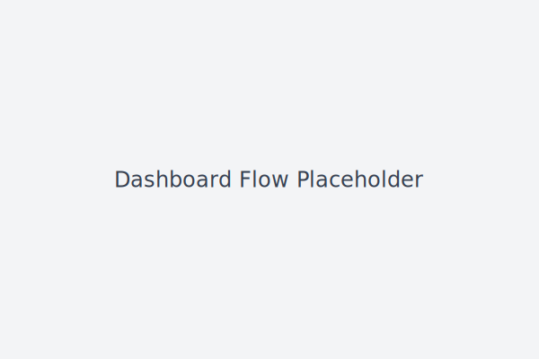
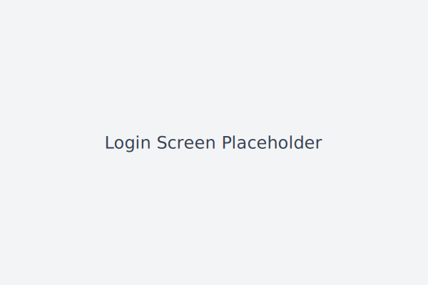

# Grant AI Platform Backend

This repository contains three microservices used to test a grant eligibility workflow.

- **server/** – Express API for authentication, file uploads and analysis forwarding
- **ai-analyzer/** – FastAPI service that extracts text using Tesseract OCR and simple NLP with confidence scores
- **eligibility-engine/** – Python rules engine returning missing fields and suggested next steps
- **ai-agent/** – LLM-ready service with conversational endpoints and smart form filling

```
project-root/
  server/               Express REST API
  ai-agent/             FastAPI form filler and reasoning service
  ai-analyzer/          OCR/NLP stub service
  eligibility-engine/   Core rules engine
  frontend/             Next.js application
```

The document upload flow accepts **PDF**, **JPG/JPEG**, and **PNG** files.

## Grant Submission Pipeline

The backend exposes a unified flow that processes grant applications end‑to‑end:

1. **POST `/api/submit-case`** – Frontend sends raw user data and uploaded documents. The server forwards everything to the AI Agent (`AI_AGENT_URL/analyze`) for extraction and normalization.
2. **AI Agent → Eligibility Engine** – Normalized data is submitted to the Eligibility Engine (`ELIGIBILITY_ENGINE_URL/check`) for rule-based eligibility checks.
3. **Eligibility → Form Filler** – The results and required form names are passed to the Form Filler (`FORM_FILLER_URL/fill-forms`) which returns filled PDFs ready for signature.
4. **Digital signature & submission** – Hooks exist after form filling for optional signing and external submission.
5. **GET `/api/status/:caseId`** – Fetch case status, eligibility results and generated documents for the applicant dashboard.

All service calls exchange JSON payloads, are logged, and bubble up descriptive errors if a downstream service fails.

Environment variables configuring service locations:

```
AI_AGENT_URL=http://ai-agent:5001
ELIGIBILITY_ENGINE_URL=http://eligibility-engine:4001
FORM_FILLER_URL=http://ai-agent:5001
```

## Running locally

1. Install Node dependencies and start the API server
   ```bash
   npm install
   node server/index.js
   ```
   Environment variables should be placed in a `.env` file. See `.env.example` for required keys.

2. Start the AI agent service
   ```bash
   cd ai-agent
   python -m uvicorn main:app --port 5001
   ```
3. Start the eligibility engine
   ```bash
   cd eligibility-engine
   python -m uvicorn main:app --port 4001
   ```
4. (Optional) Run the eligibility engine tests
   ```bash
   cd eligibility-engine
   python -m pytest
   ```

The `ai-agent` service can parse free-form notes and uploaded documents, infer missing fields
and provide human readable summaries. Eligibility results now include a `next_steps` field
along with any missing information:

```bash
curl -X POST http://localhost:5001/check -H "Content-Type: application/json" \
    -d '{"notes": "We started around 2021 and are women-led in biotech"}'
```

To fill a grant application form, send JSON directly to `/fill-forms`:

```bash
curl -X POST http://localhost:5001/fill-forms \
    -H "Content-Type: application/json" \
    -d '{
        "form_name": "sba_microloan_form",
        "user_payload": {
            "business_name": "Tech Boosters",
            "annual_revenue": 250000,
            "zipcode": "10001",
            "minority_owned": true
        }
    }'
```

## Frontend

The **frontend/** directory contains a Next.js application used for end-user registration, login and document uploads.

To start the frontend locally:

```bash
cd frontend
npm install # install dependencies (requires internet access)
npm run dev
```

Environment variables should be placed in a `.env.local` file. See `.env.local.example` for the API base URL.
The backend uses `AI_AGENT_URL`, `ELIGIBILITY_ENGINE_URL` and `FORM_FILLER_URL` to locate the downstream services.

### Testing file uploads

1. Visit [http://localhost:3000](http://localhost:3000) and register or log in.
2. From the dashboard choose **OPEN CASE** and complete the questionnaire wizard.
3. On the **Documents** step upload sample files (PDF, JPG, JPEG or PNG). Use the **Replace** button to update a document.
4. When all documents are uploaded, click **Submit for Analysis** to see eligibility results.





## Docker Compose

The repository includes a `docker-compose.yml` that spins up all services in one command. This will launch MongoDB, the API server, auxiliary Python services, and the Next.js frontend.

```bash
docker-compose up --build
```

The frontend will be available at [http://localhost:3000](http://localhost:3000) and the API at [http://localhost:5000/api](http://localhost:5000/api).
